
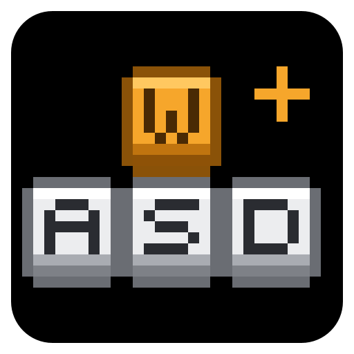

<h1 align="center">KeyBind Profiles+</h1>

Save, switch, compare and share whole sets of key binds, and manage the keys of the game, your mods, Meteor Client, MaLiLib mods and Inventory Profiles Next from one screen.

保存、切换、对比、分享整套键位，在一个界面里管理原版、各模组、Meteor Client、MaLiLib 系模组和 Inventory Profiles Next 的按键。

<a href="#english">English</a> · <a href="#简体中文">简体中文</a>

  

# English

KeyBind Profiles+ is a client-side Fabric mod for Minecraft 1.21.11 that keeps your key bindings in named profiles. Keep one profile for PvP, one for building and one for redstone, and switch with a click, with a hotkey of your own, or automatically when you join a server. A profile can also carry the game settings you pick, such as FOV or mouse sensitivity.

Its Key Binds screen puts every key in one list: the game's keys, the keys your other mods register, and the hotkeys that Meteor Client, MaLiLib mods (Litematica, Tweakeroo, MiniHUD, ...) and Inventory Profiles Next normally keep in their own menus. Every key shows the mod it comes from, conflicts are marked while you rebind, and keys can be put on Ctrl / Shift / Alt combinations.

KeyBind Profiles+ is a fork of [KeyBindProfiles](https://github.com/imsawiq/KeyBindProfiles) by sawiq_.

## Features

### Profiles

- **Named profiles.** Save your current keys as a profile, then apply, rename, edit or delete it at any time. Profiles are plain JSON files (`.kbp`) in `config/keybindprofilesplus/`, easy to back up.
- **Choose what a profile saves.** A tick tree lists every key binding, every hotkey of the supported mods and the game's own settings (FOV, sensitivity, volumes, chat, video and more), down to single entries. Anything left unticked is not touched when the profile is applied, so a profile can hold just your FOV or just your Litematica hotkeys.
- **Preview before applying.** Before a profile is applied you see every change, from the old value to the new one. Tick "Don't ask again" to skip the preview; the setting "Ask before applying" turns it back on.
- **Profile hotkeys.** Give a profile a hotkey of one or two keys (mouse buttons work too) and press it in game to switch; a short notice appears above the hotbar. Profile hotkeys only react during play, so typing in chat never switches profiles.
- **Compare profiles.** See two profiles, or a profile and your current settings, side by side with the differences highlighted. "Only differences" hides everything else; key bindings, other mods' hotkeys and saved game settings are all compared.
- **Share codes.** "Copy Code" turns a profile into one line of text starting with `KBP1-`, and "Import" turns such a line back into a profile after showing a preview. A damaged or incomplete code is explained instead of failing.
- **Picks up where you left off.** The profile you applied last is applied again when the game starts.
- **Coming from KeyBindProfiles.** On the first start, the profiles of the original mod are copied over (its own folder is left untouched) and your old key for opening the profiles is kept.

### Key Binds screen

- **Every key in one list.** Options → Controls → Key Binds opens this mod's screen in place of the vanilla one (you can switch back in the settings). Rebind keys there, and reset one key or all of them.
- **The source of every key.** Each row names the mod a key belongs to, so you can see at a glance which mod added which key. Search by name, key or mod, filter by source, group by category or by source, or show conflicts only.
- **Details on hover.** Point at a key's name for its source, category and default key; point at its key button to see what it conflicts with and why.
- **Readable key names.** Numpad keys show as "Num 5", "Num +" or "Num Enter" everywhere in the game. In this mod's screens, mod keys without a translation show readable words instead of raw names like `key.somemod.toggle_zoom`.

### Hotkeys of other mods

- **Meteor Client.** The key of every module, the key settings inside modules and your macros are listed, unbound ones included. Modules of Meteor addons get their own group ("Meteor: addon name").
- **MaLiLib mods.** Every hotkey registered with MaLiLib, for example those of Litematica, Tweakeroo, MiniHUD or Item Scroller, is listed by mod under that mod's own names.
- **Inventory Profiles Next.** Its hotkeys are kept in its own library rather than in the game's key list; here they are listed and editable next to everything else.
- **Edit them like any other key.** Click the key button and press the new key (Ctrl / Shift / Alt combinations included), press Esc for no key, or click Reset for that mod's default. The mod then saves the change in its own config file, just as if you had used its own menu.
- **Part of your profiles.** These hotkeys are saved in profiles (ticked by default in new ones), compared, listed in the preview, switched by hotkeys and auto-switch, and carried in share codes.
- **The other mod's rules still apply.** For example, Meteor does not let a module sit on the left or right mouse button, so such a change is refused with a message that says why.

### Conflicts

- **Three levels.** Red means two keys act in the same situation. Yellow means they only meet in some situations, for example only in Creative mode, or one works during play and the other only in screens. No mark means they never get in each other's way.
- **No false alarms.** `G` and `F3 + G`, `X` and `Ctrl + X`, an F3 combination added by a mod and a plain key, or Litematica's tool and the attack button are not marked; the tooltip still lists what shares the key.
- **Across mods.** A Meteor module on `Z` and a vanilla key on `Z` are marked, and so are a Meteor module and a Litematica hotkey on the same key.
- **Live and adjustable.** The marks and the conflict counter update the moment you change a key. If the mod guessed wrong about when a mod's key is in use, click the key's name and set it yourself.

### Modifier combinations

- **Ctrl / Shift / Alt + key.** Put any key binding on a combination such as `Ctrl + X`, in this mod's Key Binds screen or in the vanilla one. Pressing `Ctrl + X` triggers only the combination, while a plain `X` keeps doing whatever else is bound to it.

### Worlds and servers

- **Auto-switch.** Give a profile rules and it is applied when you join a matching world or server. A rule is an exact address (`play.example.org:25566`), a host on any port including its subdomains (`example.org`), a wildcard (`*.example.org`), `singleplayer`, `lan`, `realms`, or `*` for anywhere; the most specific matching rule wins.
- **All rules on one screen.** The Rules screen lists the rules of all profiles and lets you add or remove them. While you are in a world, it also shows which profile the rules pick there.
- **Back to a default profile.** Optionally return to a default profile whenever you leave a world or server.

### More

- **Mod Menu button.** With Mod Menu installed, KeyBind Profiles+ gets a configure button in the mod list. It opens the settings, with shortcuts to the profiles and the Key Binds screen; Mod Menu is not required.
- **Languages.** English and Simplified Chinese, plus the partial Russian translation of the original mod.
- **Client-side only.** The mod sends nothing to the server and does not change gameplay.

## Screenshots

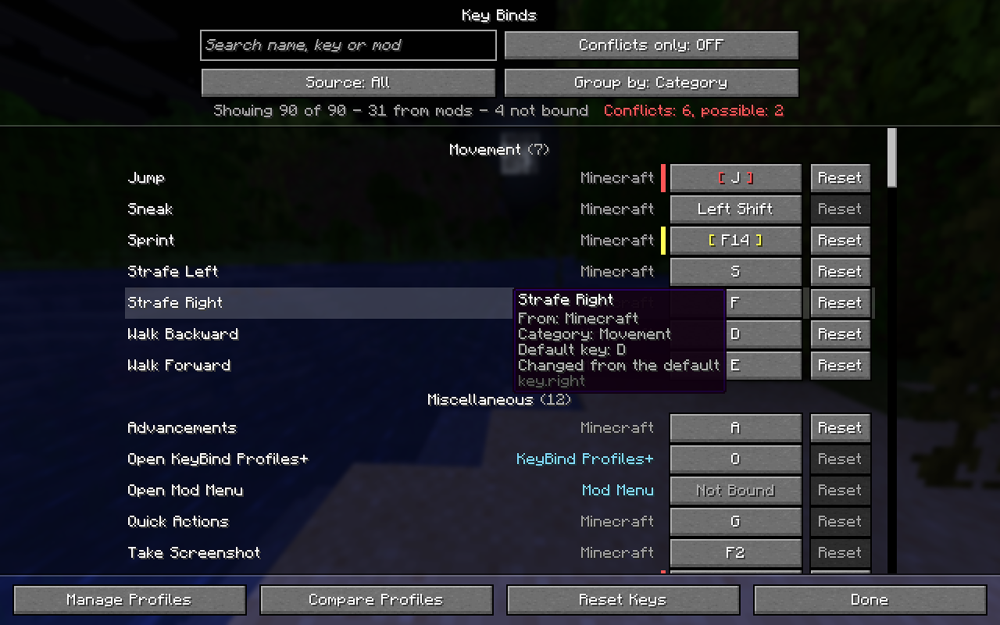

*The Key Binds screen: every key with the mod it comes from, conflicts in red (real) or yellow (possible), details on hover.*

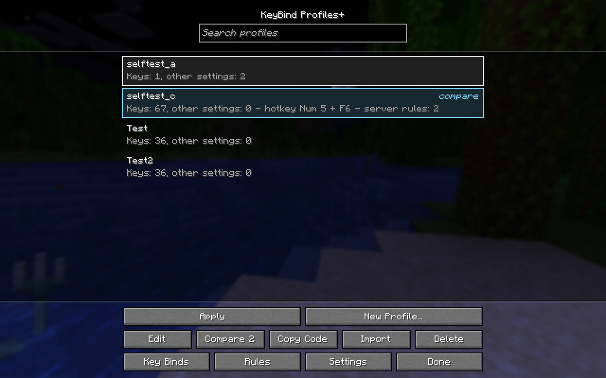

*The profile manager: one profile selected, a second one marked for comparison.*

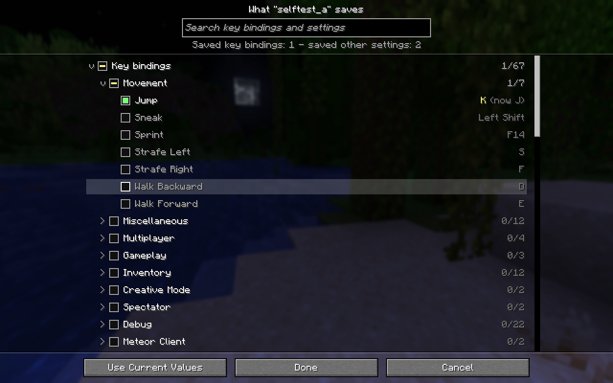

*Choose what a profile saves, down to single keys. A saved value that differs from your current one is shown in yellow.*

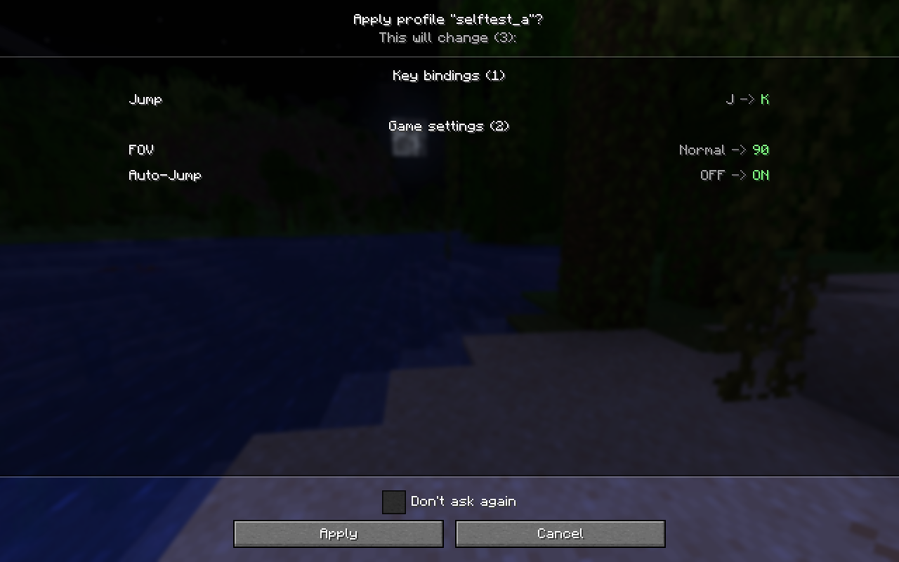

*Before a profile is applied, every change is listed from the old to the new value.*

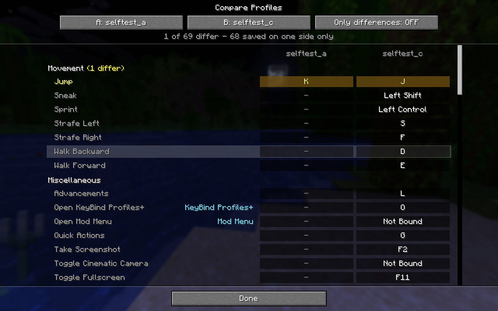

*Two profiles side by side: differences are highlighted, "-" means only one profile saves that key.*

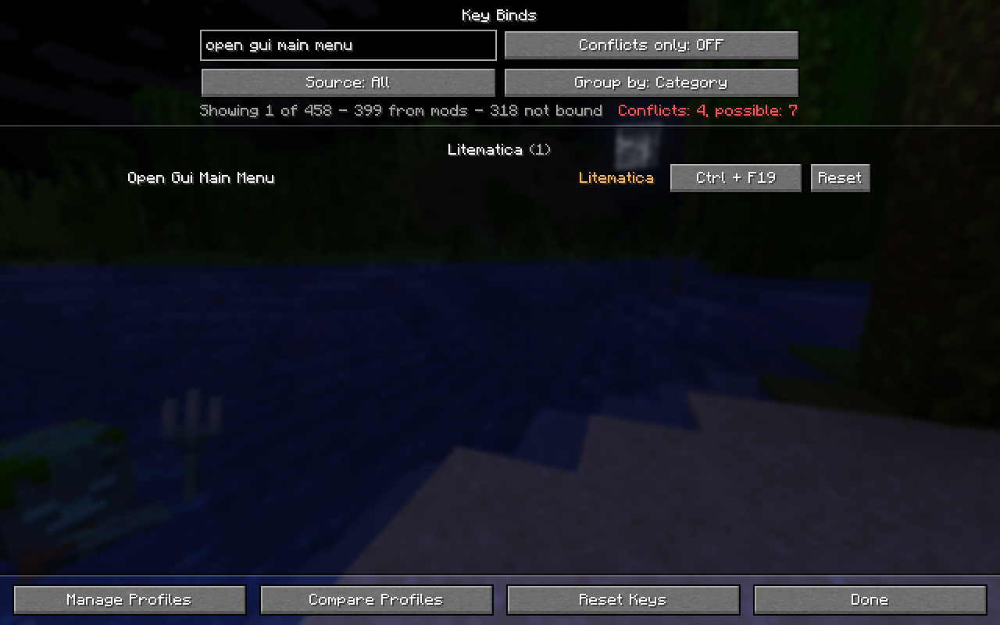

*Hotkeys of other mods sit in the same list: here Litematica's main menu hotkey, rebound to Ctrl + F19.*

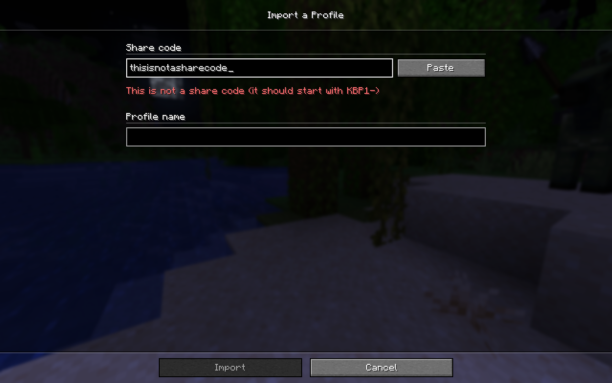

*Importing a share code: a wrong or damaged code is explained and Import stays disabled.*

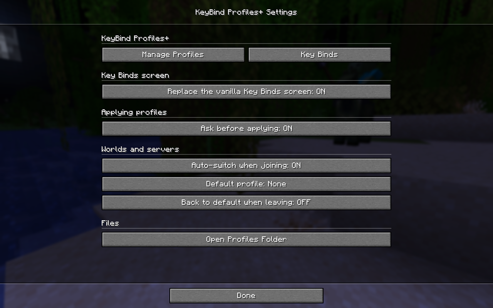

*The settings, here opened from Mod Menu, with shortcuts to the profile manager and the Key Binds screen.*

## How to use

### Keys

| Action | Default key | Where to change it |
|---|---|---|
| Open the profile manager ("Open KeyBind Profiles+") | `O` | Key Binds screen, category "Miscellaneous" |
| Switch to a particular profile | not set | Profile manager → select the profile → Edit → Hotkey |

Both work during play, when no screen is open. KeyBind Profiles+ has no commands.

Inside the mod's screens:

| Where | Input | What it does |
|---|---|---|
| Profile list | Click | Select a profile |
| Profile list | Double-click, Enter or Space | Apply the selected profile |
| Profile list | Ctrl + click or right-click | Mark a second profile, then click "Compare 2" |
| Recording a profile hotkey | Enter / Backspace / Esc | Save / remove the hotkey / cancel |
| Key Binds screen, after clicking a key button | Any key or mouse button | Bind it |
| Key Binds screen, after clicking a key button | Hold Ctrl, Shift or Alt, then press a key | Bind a combination such as `Ctrl + X` |
| Key Binds screen, after clicking a key button | Press and release Ctrl, Shift or Alt on its own | Bind that key itself |
| Key Binds screen, after clicking a key button | Esc | Leave it without a key |
| Key Binds screen | Click the name of a mod's key | Change when that key counts as in use |

### Where things are

- **Profile manager:** press `O` in game, or click "Manage Profiles" at the bottom of the Key Binds screen.
- **Key Binds screen:** Options → Controls → Key Binds, or "Key Binds" in the profile manager.
- **Settings:** "Settings" in the profile manager, or the configure button in Mod Menu.
- **Auto-switch rules:** "Rules" in the profile manager for all profiles, or Edit → "Applied automatically in" for one profile.

### Your first profile

1. Press `O` and click **New Profile...**.
2. Type a name. Every key binding and every hotkey of a supported mod is ticked; game settings are not.
3. Untick what this profile should leave alone. To include a game setting such as FOV, open **Other game settings** and tick it; the search box above the tree finds entries quickly.
4. Click **Create Profile**.

### Switching profiles

- Select a profile and click **Apply** (or double-click it). If something would change, a preview lists it first (unless you turned "Ask before applying" off); click **Apply** to confirm.
- To switch with a hotkey, select the profile, click **Edit**, click the button under **Hotkey**, press one or two keys and then Enter. In game, press the hotkey; the notice above the hotbar confirms the switch.

### Keeping a profile up to date

When you have changed keys and want a profile to keep them, select it and click **Edit** → **Saved Contents...** → **Use Current Values** → **Done**. On the same screen you can tick or untick what the profile saves; a saved value that differs from your current one is shown in yellow, with "(now ...)" next to it.

### Comparing

Select a profile and click **Compare** to compare it with your current settings. To compare two profiles, select one, Ctrl + click (or right-click) the other and click **Compare 2**. In the compare screen, A and B can be set to any profile or to "Current settings", and **Only differences** hides all rows that match.

### Sharing

Select a profile and click **Copy Code**: the code is now in your clipboard, ready to paste into a chat or a file. To use a code, click **Import** → **Paste**, check the preview and the suggested name, and click **Import**.

### Auto-switching on servers

1. Select a profile → **Edit** → **Applied automatically in**.
2. Type an address or rule and click **Add**, or use **+ Singleplayer** or the button showing the address of the server you are on (or joined last).
3. To go back to a default profile when you leave: set **Use as default profile** to ON for that profile (or choose it under Settings → **Default profile**), then turn on **Back to default when leaving** in the settings.

### Rebinding keys and fixing conflicts

1. Open Options → Controls → Key Binds.
2. Click a key button: it shows `> key <` while it waits. Press the new key, a combination or a mouse button, or Esc for no key. **Reset** on a row restores its default; **Reset Keys** at the bottom resets all game key bindings after asking.
3. Conflicts show as `[ key ]` in red or yellow, with a bar of the same colour. Point at the key button to see with what and why, or turn on **Conflicts only** to list nothing else.
4. If a mod's key is marked although it can never clash (or the other way round), click its name. Each click changes when it counts as in use: automatic, during play, only while a screen is open, only in a special situation (never a conflict), and back to automatic. Vanilla keys and F3 combinations follow fixed rules.

## Settings

Open them with "Settings" in the profile manager or with the configure button in Mod Menu.

| Setting | Default | What it does |
|---|---|---|
| Replace the vanilla Key Binds screen | ON | ON: Options → Controls → Key Binds opens this mod's screen. OFF: the vanilla screen is kept, with this mod's buttons, conflict marks and combination recording added (hotkeys of other mods are only listed in this mod's screen). |
| Ask before applying | ON | The Apply button first shows what will change. Hotkeys and auto-switch never ask. |
| Auto-switch when joining | ON | Applies the profile whose rule matches the world or server you join. |
| Default profile | None | The profile to go back to when you leave a world or server. |
| Back to default when leaving | OFF | Applies the default profile again whenever you leave a world or server. |
| Open Profiles Folder | (button) | Opens `config/keybindprofilesplus/` in your file manager. |

Each profile has its own options under **Edit**:

| Option | Default | What it does |
|---|---|---|
| Hotkey | Not set | One or two keys that switch to this profile during play. |
| Saved Contents... | New profiles: all key bindings and mod hotkeys, no game settings | What the profile saves and applies. |
| Applied automatically in | No rules | Worlds and servers in which this profile is applied when you join. |
| Use as default profile | OFF | Makes this the profile to go back to (the same as "Default profile" above). |

## Requirements

- Minecraft Java Edition 1.21.11
- Fabric Loader 0.17.3 or newer
- [Fabric API](https://modrinth.com/mod/fabric-api)
- Java 21 or newer
- Client-side only: install it in your game. Servers do not need it, and it works on any server.

Optional, each one only adds its own part:

| Mod | What it adds |
|---|---|
| [Mod Menu](https://modrinth.com/mod/modmenu) | A configure button in the mod list |
| [Meteor Client](https://meteorclient.com) (and its addons) | Module keys, key settings and macros in the Key Binds screen and in profiles |
| [MaLiLib](https://modrinth.com/mod/malilib) and the mods built on it ([Litematica](https://modrinth.com/mod/litematica), Tweakeroo, MiniHUD, Item Scroller, ...) | Their hotkeys in the Key Binds screen and in profiles |
| [Inventory Profiles Next](https://modrinth.com/mod/inventory-profiles-next) (with libIPN) | Its hotkeys in the Key Binds screen and in profiles |

Tested with Mod Menu 17.0.1, Meteor Client for 1.21.11 (build 86), MaLiLib 0.27.20 with Litematica 0.26.16, and Inventory Profiles Next 2.2.6 with libIPN 6.6.3.

## Compatibility

- **Meteor Client, MaLiLib mods, Inventory Profiles Next:** tested with the versions above. Meteor addons and other MaLiLib mods (Tweakeroo, MiniHUD, Item Scroller, ...) are read the same way as Meteor itself and Litematica, but have not each been tested. If a future version of one of these mods changes too much inside, its hotkeys become read-only (Meteor, MaLiLib) or are left out (Inventory Profiles Next) instead of causing errors, and a warning is written to the log.
- **Other key binds screens:** only the vanilla Key Binds screen is replaced. If another mod opens a key binds screen of its own, that screen is left as it is.
- **Mods that add F3 combinations:** keys that mods put into the game's Debug category are treated like the vanilla F3 combinations, so they do not clash with plain keys.
- **Inventory and recipe mods:** key bindings of mods known to work only inside screens (for example REI, JEI, EMI, Mouse Tweaks, Mouse Wheelie) count as "only while a screen is open" for the conflict check. Any guess can be corrected by clicking the key's name.
- **Rendering mods:** KeyBind Profiles+ does not change how the world is rendered, so it is not expected to interact with Sodium, Iris or similar mods. This combination has not been specifically tested.
- **The original KeyBindProfiles:** KeyBind Profiles+ takes over its job and its profiles, and the two cannot be installed together (the game tells you at startup).

## Installation

1. Install Fabric Loader 0.17.3 or newer for Minecraft 1.21.11.
2. Download Fabric API for 1.21.11 and KeyBind Profiles+, and put both jar files into the `mods` folder of your game.
3. Optional: add Mod Menu and any of the mods listed under Requirements.
4. Start the game and press `O` to open the profile manager.

Switching from the original KeyBindProfiles: remove its jar (the two cannot run together). Your profiles are copied over on the first start.

Building from source: run `./gradlew build` (`gradlew build` on Windows) with JDK 21. The jar ends up in `build/libs/`.

## FAQ

**Does it work on servers?**
Yes. KeyBind Profiles+ only changes key and game settings on your own computer; it sends nothing to the server and does not change gameplay. Server rules about other mods, such as Meteor Client, are a separate matter.

**Do I need Mod Menu, Meteor Client, Litematica or Inventory Profiles Next?**
No. They are all optional. Without them, their parts simply do not appear.

**Where are my profiles, and how do I back them up?**
In `config/keybindprofilesplus/` inside your game folder, one `.kbp` file (plain JSON) per profile, next to the mod's own settings. Settings → "Open Profiles Folder" opens it; copying the folder backs up everything.

**I changed some keys, restarted the game, and my changes were gone.**
When the game starts, KeyBind Profiles+ applies the profile you applied last. Save your changes into that profile first (Edit → Saved Contents... → Use Current Values → Done), or save them as a new profile and apply that one.

**Why is a key marked yellow, or not marked at all, although another key uses it?**
Point at its key button: the tooltip lists what shares the key and why it counts as a real, a possible or no conflict. If the mod guessed wrong about when a mod's key is in use, click the key's name to change it.

**A hotkey of another mod has no key button.**
It is read-only. It belongs to a Meteor profile that is not loaded (shown in grey), or that mod could not be reached. Point at its name for details and change it in that mod.

**How do I get the vanilla Key Binds screen back?**
Settings → "Replace the vanilla Key Binds screen" → OFF. The vanilla screen then gets this mod's buttons, conflict marks and combination recording.

**I used the original KeyBindProfiles. What happens to my profiles?**
On the first start they are copied to `config/keybindprofilesplus/` (the old folder is not changed), and your old key for opening the profiles carries over.

## Known limitations

- Combinations use Ctrl, Shift and Alt only (the left and right keys count the same) plus one key or mouse button. The Windows / Command key is not supported; Meteor binds that use it are shown but not checked for conflicts.
- While the modifier of a combination is held, only the combination reacts on that key. For example, with something on `Ctrl + W`, holding Ctrl to sprint and pressing W does not walk forward, so avoid combinations on keys you already press together with that modifier.
- Hotkeys of other mods can only be changed while that mod is running. Key binds stored in Meteor profiles that are not loaded are read-only.
- For Inventory Profiles Next, only the main key of each hotkey is shown and changed; its alternative keys stay as they are.
- "Reset Keys" resets the game's key bindings. Hotkeys of other mods are reset with the Reset button on their own rows.
- Share codes do not include the profile's hotkey and server rules.
- The notice above the hotbar uses the same line as the name of the held item and can overlap it.
- The Russian translation covers only a few lines; everything else is shown in English.

## Credits

- **sawiq_**, author of [KeyBindProfiles](https://github.com/imsawiq/KeyBindProfiles). KeyBind Profiles+ grew out of it: saving and switching key binding profiles, profile hotkeys and switching per server started there. Its MIT notice is kept in [LICENSE-upstream-MIT](LICENSE-upstream-MIT).
- KeyBind Profiles+ is developed by Autyism.

## License

**GPL-3.0-only.** KeyBind Profiles+ is free software under the GNU General Public License v3.0 (see [LICENSE](LICENSE)); the original KeyBindProfiles code by sawiq_ that it started from is MIT-licensed, and its notice is kept in [LICENSE-upstream-MIT](LICENSE-upstream-MIT).

# 简体中文

KeyBind Profiles+ 是 Minecraft 1.21.11 的纯客户端 Fabric 模组，把你的键位存成有名字的档案。PvP 一套、建筑一套、红石一套，点一下、按一个自己设的热键，或者进服务器时自动切换。档案还可以顺带保存你选中的游戏设置，比如视场角或鼠标灵敏度。

它自带的按键绑定界面把所有按键放进同一个列表：原版的按键、其他模组注册的按键，还有 Meteor Client、MaLiLib 系模组（Litematica 投影、Tweakeroo、MiniHUD……）和 Inventory Profiles Next 平时只能在各自菜单里改的热键。每个键都标着来自哪个模组，改键时实时标出冲突，还能绑 Ctrl / Shift / Alt 组合键。

KeyBind Profiles+ 是 sawiq_ 的 [KeyBindProfiles](https://github.com/imsawiq/KeyBindProfiles) 的分支版本（fork）。

## 功能

### 档案

- **有名字的档案。** 把当前键位存成档案，之后随时应用、重命名、编辑或删除。档案是 `config/keybindprofilesplus/` 下能直接看懂的 JSON 文件（`.kbp`），备份也方便。
- **自选保存内容。** 一棵勾选树列出所有键位、支持的模组的所有热键，以及游戏自身的设置（视场角、灵敏度、音量、聊天、视频等等），可以细到单独一项。没勾的项目在应用档案时不会被改动，所以一个档案可以只存视场角，或者只存 Litematica 的热键。
- **应用前预览。** 应用档案之前，先列出每一项会从什么改成什么。勾上“下次不再询问”就跳过预览，设置里的“应用前先确认”可以重新打开。
- **档案热键。** 给档案设一个热键（一个键或两个键同时按，鼠标键也行），在游戏里按下就切换过去，快捷栏上方会短暂提示。档案热键只在游戏中生效，在聊天栏打字时不会误切。
- **档案对比。** 把两个档案，或者一个档案和当前设置并排显示，不同的地方高亮。“只看差异”会隐藏其余各行；键位、其他模组的热键和保存的游戏设置都会参与对比。
- **分享码。** “复制分享码”把档案变成一行以 `KBP1-` 开头的文字，“导入”会先显示预览，再把这行文字还原成档案。损坏或不完整的分享码会说明原因，不会出错。
- **接着上次用。** 启动游戏时，会重新应用你上次应用的档案。
- **从 KeyBindProfiles 换过来。** 第一次启动时会把原模组的档案复制过来（原来的文件夹不动），原来打开档案界面的按键也会保留。

### 按键绑定界面

- **所有按键一个列表。** 选项 → 控制 → 按键绑定，打开的是本模组的界面，替代原版界面（设置里可以换回原版）。在里面直接改键，可以重置单个键，也可以全部重置。
- **每个键的来源。** 每一行都标着这个键属于哪个模组，一眼就能看出哪个键是哪个模组加的。可以按名称、按键或模组搜索，按来源筛选，按分类或按来源分组，或者只看冲突。
- **悬停显示详情。** 鼠标停在名称上显示来源、分类和默认按键；停在按键按钮上显示和谁冲突、为什么。
- **看得懂的键名。** 小键盘的键在整个游戏里都显示成“小键盘 5”“小键盘 +”这样，和主键盘区分开。在本模组的界面里，没有翻译的模组按键会显示成能读懂的词，而不是 `key.somemod.toggle_zoom` 这种原始名字。

### 其他模组的热键

- **Meteor Client。** 每个模块的按键、模块设置里的按键以及宏都会列出来，没绑键的也在。Meteor 插件的模块单独成组（“Meteor：插件名”）。
- **MaLiLib 系模组。** 在 MaLiLib 注册的所有热键，比如 Litematica、Tweakeroo、MiniHUD、Item Scroller 的热键，按模组分组列出，名字用模组自己的叫法。
- **Inventory Profiles Next。** 它的热键放在它自己的前置库里，不在游戏的按键列表中；这里会把它们和其他按键列在一起，也能直接改。
- **和普通按键一样改。** 点按键按钮再按新键（也可以是 Ctrl / Shift / Alt 组合键），按 Esc 不绑任何键，点“重置”回到那个模组自己的默认键。改动交给那个模组，由它自己写进它的配置文件，和在它自己的菜单里改一样。
- **存进档案。** 这些热键会存进档案（新建档案时默认勾选），参与对比、出现在应用预览里，跟着热键切换和自动切换一起切，也会带进分享码。
- **照样遵守那个模组的规矩。** 比如 Meteor 不允许把模块绑到鼠标左键或右键，这样改会被拒绝，并提示原因。

### 冲突

- **三档。** 红色：两个键在同一种场合都会起作用。黄色：只在某些场合才会碰上，比如只在创造模式下，或者一个在游戏中生效、另一个只在打开界面时生效。不标记：两个键永远不会互相干扰。
- **不误报。** `G` 和 `F3 + G`、`X` 和 `Ctrl + X`、模组加的 F3 组合键和普通键、Litematica 的工具和攻击键，都不会被标成冲突；提示框里仍会列出共用这个键的是谁。
- **跨模组。** Meteor 模块绑在 `Z`、原版某个键也在 `Z`，会被标出来；Meteor 模块和 Litematica 热键同键也一样。
- **实时、可调整。** 改键的同一瞬间，冲突标记和冲突计数就会更新。如果模组对某个模组按键的生效场合判断错了，点一下按键名称自己设定。

### 组合键

- **Ctrl / Shift / Alt + 键。** 任何键位都可以绑成 `Ctrl + X` 这样的组合键，本模组的按键绑定界面和原版界面里都能录入。按 `Ctrl + X` 只触发组合键，单按 `X` 时，绑在 `X` 上的其他功能照常工作。

### 世界与服务器

- **自动切换。** 给档案加上规则，进入匹配的世界或服务器时就会自动应用它。规则可以是完整地址（`play.example.org:25566`）、主机名（`example.org`，任意端口和子域名都算）、通配符（`*.example.org`）、`singleplayer`（单人游戏）、`lan`（局域网）、`realms`，或者 `*`（任何地方）；有多条规则匹配时，最具体的那条生效。
- **所有规则一个界面。** “服务器规则”界面列出所有档案的全部规则，可以添加、移除。在世界里打开时，还会显示这里按规则会用哪个档案。
- **切回默认档案。** 可以设置在离开世界或服务器时切回默认档案。

### 其他

- **Mod Menu 配置按钮。** 装了 Mod Menu 的话，模组列表里 KeyBind Profiles+ 会有配置按钮，点开是设置界面，最上面还有进入档案管理和按键绑定界面的按钮。Mod Menu 不是必需的。
- **语言。** 英文和简体中文，另外附带原模组留下的部分俄语翻译。
- **纯客户端。** 不向服务器发送任何东西，也不改变游戏玩法。

## 截图

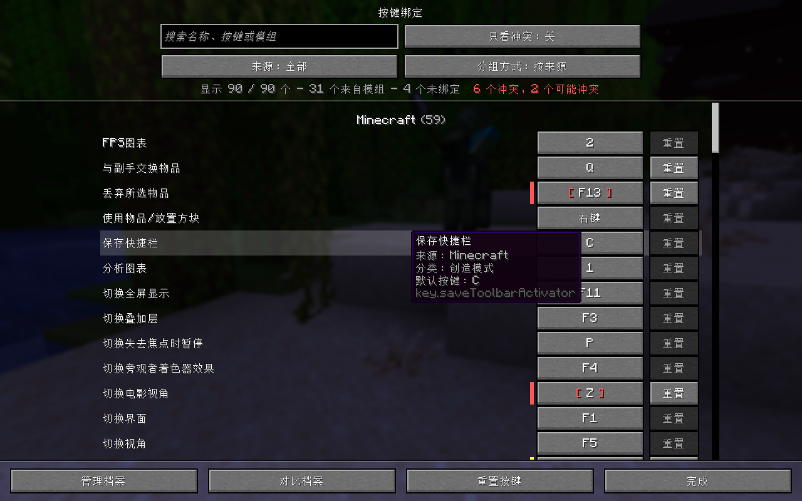

*按键绑定界面（这里按来源分组）：冲突的键标红，鼠标停在名称上显示来源、分类和默认按键。*

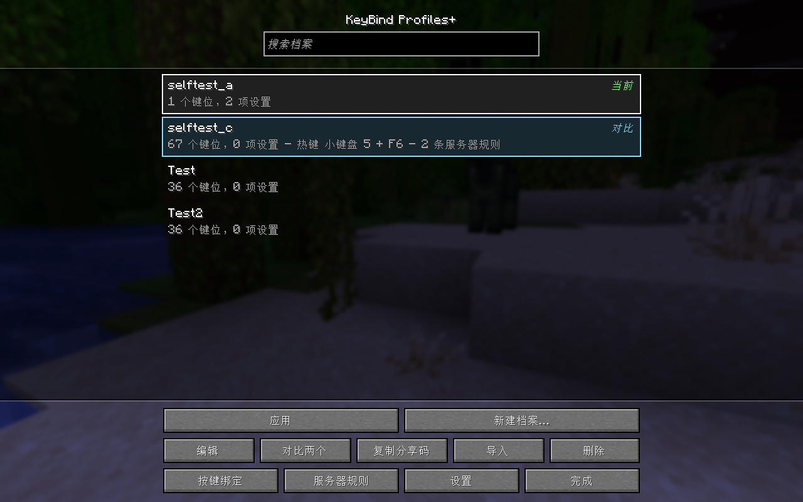

*档案管理界面：选中一个档案（“当前”表示正在使用），另一个标记为“对比”。*

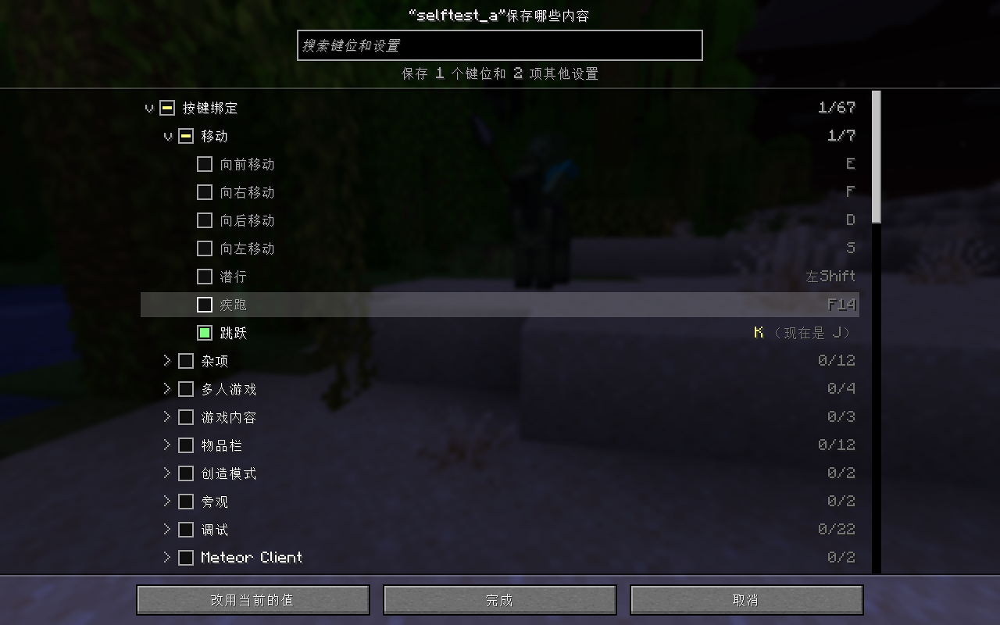

*自选档案保存哪些内容，可以细到单个键位；保存的值和现在不同时标黄。*

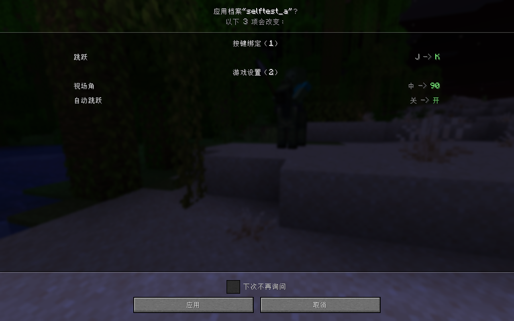

*应用档案前，列出每一项会从什么改成什么。*

*并排对比两个档案：不同的行高亮，“-”表示只有一个档案保存了这一项（英文界面截图）。*

*其他模组的热键也在同一个列表里：这里把 Litematica 打开主菜单的热键改成了 Ctrl + F19（英文界面截图）。*

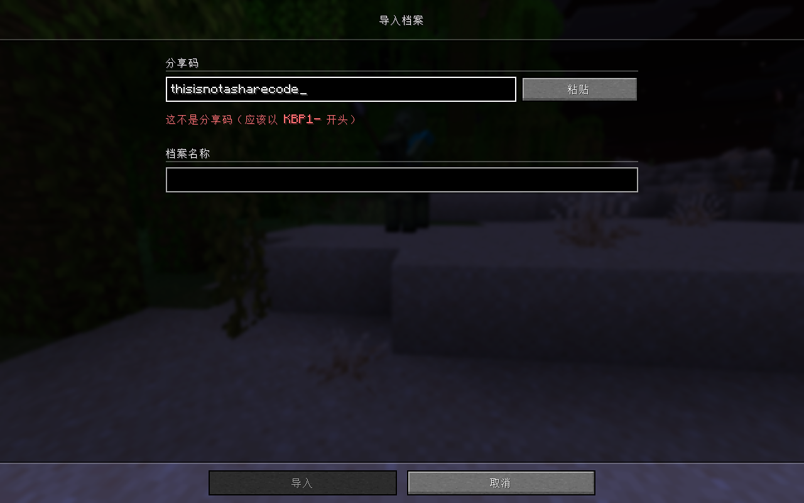

*导入分享码：不对或损坏的分享码会说明原因，“导入”按钮不可用。*

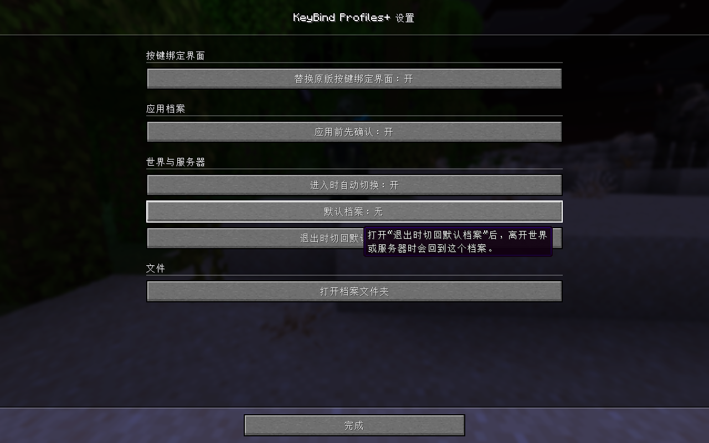

*设置界面：替换原版按键绑定界面、应用前先确认、自动切换和默认档案。*

## 使用方法

### 按键

| 功能 | 默认按键 | 在哪里改 |
|---|---|---|
| 打开档案管理界面（“打开 KeyBind Profiles+”） | `O` | 按键绑定界面，“杂项”分类 |
| 切换到某个档案 | 未设置 | 档案管理界面 → 选中档案 → 编辑 → 热键 |

这两个都在游戏中（没打开任何界面时）生效。KeyBind Profiles+ 没有命令。

模组界面里的操作：

| 位置 | 操作 | 作用 |
|---|---|---|
| 档案列表 | 单击 | 选中档案 |
| 档案列表 | 双击、回车或空格 | 应用选中的档案 |
| 档案列表 | 按住 Ctrl 点击，或右键点击 | 标记第二个档案，再点“对比两个” |
| 录入档案热键时 | 回车 / 退格 / Esc | 保存 / 清除热键 / 取消 |
| 按键绑定界面，点了按键按钮之后 | 任意键或鼠标键 | 绑定这个键 |
| 按键绑定界面，点了按键按钮之后 | 按住 Ctrl、Shift 或 Alt 再按一个键 | 绑定 `Ctrl + X` 这样的组合键 |
| 按键绑定界面，点了按键按钮之后 | 单独按一下 Ctrl、Shift 或 Alt 再松开 | 绑定这个键本身 |
| 按键绑定界面，点了按键按钮之后 | Esc | 不绑定任何键 |
| 按键绑定界面 | 点模组按键的名称 | 更改这个键的生效场合 |

### 各个界面在哪

- **档案管理界面：** 游戏中按 `O`，或点按键绑定界面底部的“管理档案”。
- **按键绑定界面：** 选项 → 控制 → 按键绑定，或档案管理界面里的“按键绑定”。
- **设置：** 档案管理界面里的“设置”，或 Mod Menu 里的配置按钮。
- **自动切换规则：** 档案管理界面里的“服务器规则”（所有档案），或“编辑”里的“在这些地方自动应用”（单个档案）。

### 创建第一个档案

1. 按 `O`，点 **新建档案…**。
2. 输入名称。所有键位和支持的模组的热键默认都勾上，游戏设置默认不勾。
3. 取消勾选这个档案不该改动的项目。想带上视场角之类的游戏设置，就展开 **其他游戏设置** 把它勾上；树上方的搜索框能快速找到项目。
4. 点 **创建档案**。

### 切换档案

- 选中档案点 **应用**（或者双击）。如果有东西会改变，会先列出来（除非你关掉了“应用前先确认”），点 **应用** 确认。
- 想用热键切换：选中档案，点 **编辑**，点 **热键** 下面的按钮，按一个或两个键，再按回车。在游戏里按这个热键，快捷栏上方的提示会告诉你已经切换。

### 更新档案

改了键位又想让档案记住时：选中档案，点 **编辑** → **保存内容…** → **改用当前的值** → **完成**。同一个界面里也可以勾选、取消勾选档案保存的项目；保存的值和现在不同时会标黄，旁边写着“（现在是 …）”。

### 对比

选中一个档案点 **对比**，就是这个档案和当前设置对比。要对比两个档案：选中一个，按住 Ctrl 点击（或右键点击）另一个，再点 **对比两个**。对比界面里 A、B 两边都可以换成任意档案或“当前设置”，**只看差异** 会隐藏相同的行。

### 分享

选中档案点 **复制分享码**，分享码就进了剪贴板，可以贴到聊天或文件里。使用分享码：点 **导入** → **粘贴**，看一下预览和自动填好的名称，点 **导入**。

### 进服务器自动切换

1. 选中档案 → **编辑** → **在这些地方自动应用**。
2. 输入地址或规则点 **添加**，或者点 **+ 单人游戏**，或点显示着当前（或上次进入的）服务器地址的按钮。
3. 想在离开时切回默认档案：把那个档案的 **设为默认档案** 打开（或在设置的 **默认档案** 里选它），再在设置里打开 **退出时切回默认档案**。

### 改键和处理冲突

1. 打开 选项 → 控制 → 按键绑定。
2. 点一个按键按钮，等待输入时它显示成 `> 键 <`。按新键、组合键或鼠标键，按 Esc 就是不绑键。每行的 **重置** 回到默认键；底部的 **重置按键** 会先确认，再把所有游戏键位恢复默认。
3. 冲突的键显示成红色或黄色的 `[ 键 ]`，左边有同色的竖条。鼠标停在按键按钮上可以看到和谁冲突、为什么；打开 **只看冲突** 就只列出这些键。
4. 如果某个模组的键明明不会冲突却被标了（或者反过来），点它的名称。每点一次切换它的生效场合：自动 → 游戏中 → 仅在打开界面时 → 只在特定情况下（不算冲突）→ 自动。原版按键和 F3 组合键的规则是固定的。

## 设置

在档案管理界面里点“设置”，或在 Mod Menu 里点配置按钮。

| 设置 | 默认 | 作用 |
|---|---|---|
| 替换原版按键绑定界面 | 开 | 开：选项 → 控制 → 按键绑定 打开本模组的界面。关：保留原版界面，只在上面加本模组的按钮、冲突标记和组合键录入（其他模组的热键只在本模组的界面里列出）。 |
| 应用前先确认 | 开 | 点“应用”时先列出会改变什么。热键切换和自动切换不会询问。 |
| 进入时自动切换 | 开 | 进入世界或服务器时，应用规则匹配的档案。 |
| 默认档案 | 无 | 离开世界或服务器时要切回的档案。 |
| 退出时切回默认档案 | 关 | 每次离开世界或服务器时重新应用默认档案。 |
| 打开档案文件夹 | （按钮） | 在文件管理器里打开 `config/keybindprofilesplus/`。 |

每个档案在 **编辑** 里还有自己的选项：

| 选项 | 默认 | 作用 |
|---|---|---|
| 热键 | 未设置 | 在游戏中切换到这个档案的一个或两个键。 |
| 保存内容… | 新档案：所有键位和模组热键，不含游戏设置 | 档案保存并应用哪些内容。 |
| 在这些地方自动应用 | 没有规则 | 进入哪些世界或服务器时自动应用这个档案。 |
| 设为默认档案 | 关 | 把它设为要切回的档案（和上面的“默认档案”是同一个设置）。 |

## 运行要求

- Minecraft Java 版 1.21.11
- Fabric Loader 0.17.3 及以上
- [Fabric API](https://modrinth.com/mod/fabric-api)（前置）
- Java 21 及以上
- 纯客户端：装在自己的游戏里就行，服务器不用装，任何服务器都能用。

可选，装了才有对应的部分：

| 模组 | 增加的内容 |
|---|---|
| [Mod Menu](https://modrinth.com/mod/modmenu) | 模组列表里的配置按钮 |
| [Meteor Client](https://meteorclient.com)（及其插件） | 模块按键、模块设置里的按键和宏，出现在按键绑定界面和档案里 |
| [MaLiLib](https://modrinth.com/mod/malilib) 及基于它的模组（[Litematica](https://modrinth.com/mod/litematica) 投影、Tweakeroo、MiniHUD、Item Scroller……） | 它们的热键，出现在按键绑定界面和档案里 |
| [Inventory Profiles Next](https://modrinth.com/mod/inventory-profiles-next)（需要 libIPN） | 它的热键，出现在按键绑定界面和档案里 |

测试过的版本：Mod Menu 17.0.1、Meteor Client 1.21.11（build 86）、MaLiLib 0.27.20 加 Litematica 0.26.16、Inventory Profiles Next 2.2.6 加 libIPN 6.6.3。

## 兼容性

- **Meteor Client、MaLiLib 系模组、Inventory Profiles Next：** 用上面的版本测试过。Meteor 插件和其他 MaLiLib 系模组（Tweakeroo、MiniHUD、Item Scroller……）和 Meteor 本体、Litematica 走的是同一条路，但没有逐个测试。如果这些模组将来的版本内部改动太大，它们的热键会变成只读（Meteor、MaLiLib）或者不再列出（Inventory Profiles Next），不会报错，日志里会写一行警告。
- **其他按键绑定界面：** 只替换原版的按键绑定界面。如果别的模组打开的是它自己的按键界面，本模组不会去动它。
- **添加 F3 组合键的模组：** 模组放进游戏“调试”分类的按键，会和原版 F3 组合键一样处理，不会和普通按键算冲突。
- **物品栏和配方类模组：** 已知只在界面里起作用的模组（比如 REI、JEI、EMI、Mouse Tweaks、Mouse Wheelie），它们的键位在冲突检测里按“仅在打开界面时”处理。判断不对的话，点按键名称就能改。
- **渲染类模组：** KeyBind Profiles+ 不改变世界的渲染，和 Sodium、Iris 之类的模组应该互不影响，但没有专门测试过这种组合。
- **原版 KeyBindProfiles：** KeyBind Profiles+ 接替了它的功能和档案，两个不能同时安装（启动时游戏会提示）。

## 安装

1. 为 Minecraft 1.21.11 安装 Fabric Loader 0.17.3 或更新版本。
2. 下载 1.21.11 版的 Fabric API 和 KeyBind Profiles+，把两个 jar 文件放进游戏的 `mods` 文件夹。
3. 可选：再装上 Mod Menu，以及“运行要求”里列出的任意模组。
4. 启动游戏，按 `O` 打开档案管理界面。

从原版 KeyBindProfiles 换过来：把它的 jar 删掉（两个不能同时运行），第一次启动时档案会复制过来。

自己构建：用 JDK 21 运行 `./gradlew build`（Windows 上是 `gradlew build`），jar 在 `build/libs/` 里。

## 常见问题

**能在服务器上用吗？**
能。KeyBind Profiles+ 只改你自己电脑上的按键和游戏设置，不向服务器发送任何东西，也不改变玩法。服务器对其他模组（比如 Meteor Client）有什么规定，是另一回事。

**必须装 Mod Menu、Meteor Client、Litematica 或 Inventory Profiles Next 吗？**
不用，都是可选的。没装的话，对应的部分就不出现。

**档案存在哪？怎么备份？**
在游戏目录的 `config/keybindprofilesplus/` 里，每个档案一个 `.kbp` 文件（JSON），模组自己的设置也在这里。设置里的“打开档案文件夹”能直接打开它；把整个文件夹复制一份就全备份了。

**我改了几个键，重启游戏后又变回去了。**
启动游戏时，KeyBind Profiles+ 会重新应用你上次应用的档案。先把改动存进那个档案（编辑 → 保存内容… → 改用当前的值 → 完成），或者存成一个新档案再应用它。

**另一个键也用着这个键，为什么只标黄，甚至不标？**
把鼠标停在它的按键按钮上：提示框会列出共用这个键的是谁，以及为什么算真冲突、可能冲突或不算冲突。如果模组对某个模组按键的生效场合判断错了，点按键名称就能改。

**有个其他模组的热键没有按键按钮。**
它是只读的：它属于一个没有加载的 Meteor 配置（显示为灰色），或者连不上那个模组。鼠标停在名称上可以看详情，要改请到那个模组里改。

**怎么换回原版的按键绑定界面？**
设置 → “替换原版按键绑定界面” → 关。之后原版界面上会加上本模组的按钮、冲突标记和组合键录入。

**我以前用的是原版 KeyBindProfiles，档案会怎样？**
第一次启动时，档案会复制到 `config/keybindprofilesplus/`（旧文件夹不动），原来打开档案界面的按键也会沿用。

## 已知限制

- 组合键只支持 Ctrl、Shift、Alt（左右不区分），加一个键或鼠标键。不支持 Windows / Command 键；用到它的 Meteor 绑定会显示出来，但不参与冲突检测。
- 按住组合键的修饰键时，这个键上只有组合键会响应。比如有功能绑在 `Ctrl + W` 上时，按住 Ctrl 疾跑再按 W 不会向前走，所以别把组合键放在平时就会和这个修饰键一起按的键上。
- 其他模组的热键只有在那个模组运行时才能改。没有加载的 Meteor 配置里的按键是只读的。
- Inventory Profiles Next 只显示和修改每个热键的主按键，它的备用按键保持不变。
- “重置按键”只重置游戏的键位；其他模组的热键要用它们各自那一行的“重置”按钮。
- 分享码不包含档案的热键和服务器规则。
- 快捷栏上方的提示和手持物品名称在同一行，同时出现时会叠在一起。
- 俄语翻译只有少数几行，其余显示英文。

## 致谢

- **sawiq_**，[KeyBindProfiles](https://github.com/imsawiq/KeyBindProfiles) 的作者。KeyBind Profiles+ 由它发展而来：保存和切换键位档案、档案热键、按服务器切换都源自那里。它的 MIT 协议声明保留在 [LICENSE-upstream-MIT](LICENSE-upstream-MIT)。
- KeyBind Profiles+ 由 Autyism 开发。

## 协议

**GPL-3.0-only。** KeyBind Profiles+ 是遵循 GNU 通用公共许可证第 3 版的自由软件（见 [LICENSE](LICENSE)）；它起步时使用的 sawiq_ 的 KeyBindProfiles 原始代码采用 MIT 协议，其声明保留在 [LICENSE-upstream-MIT](LICENSE-upstream-MIT)。
